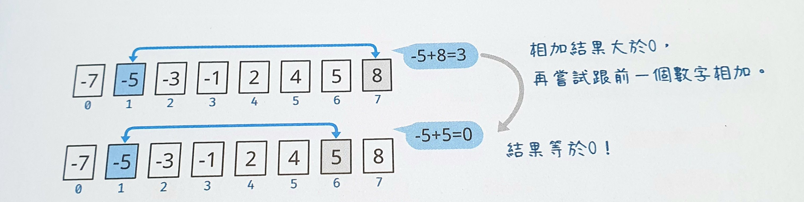

# Lesson 1

## 1-1 認識 C 語言

### keywords

- `main` 主要
- `integer`, 整數
- `print`, 列印

### agenda

- 用 `code::block`建專案、查看預設程式碼、執行
- 說明註解的用法
- 修改印出的內容
- 介紹函數
  
- 刪掉結尾的分號試試看結果
- 大小寫有差嗎？把`printf`改成`Printf`試試

## 1-2 C語言的基本結構與執行流程
_review_  
快速建立預設專案

> 本節開始


- 前一節的`printf`這個指令(工具)就是收納在`stdio.h`這個函式庫(工具箱)裏
- `main`也是一個函數嗎
- 把`printf`函式改成兩個命令獨立的函式試試
```C
printf("悠然天地間，");
printf("得此大自在。"); 
```
- 結果只有印出一行，加入`\n`換行

## 1-3 電腦語言翻譯機:編譯器與直譯器
_review_  
建新專案印出兩行內容

> 本節開始
### 電腦只認得機械碼
- 機械碼就是用0和1組成的程式，但是人類看不懂
- 人類編寫的程式要經過轉譯成機械碼後電腦才能看懂，轉譯有以下三種方式
    * 編譯(compile)
    * 直譯(interpret)
    * 組譯(assembly)
- C語言是哪一種？

### C語言的編譯或建置過程


## 1-4 資料結構與演算法

### 從一系列已排序數字找出兩個和為0的數字
`-7` `-5` `-3` `-1` `2` `4` `5` `8`  
這個例子一眼就能看出結果吧，但如果是很大的數列呢？例如1000個數字

### 暴力解


### 較佳解
資料已經排序過，兩個正數或兩個負數加起來一定不會是0，所以應該從一正一負相加著手




